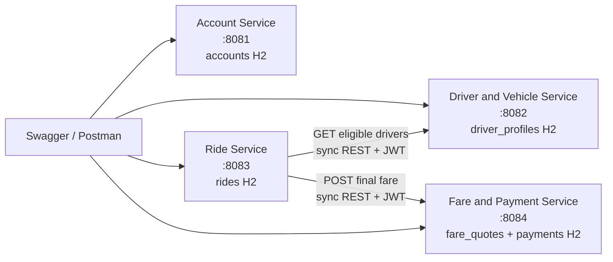
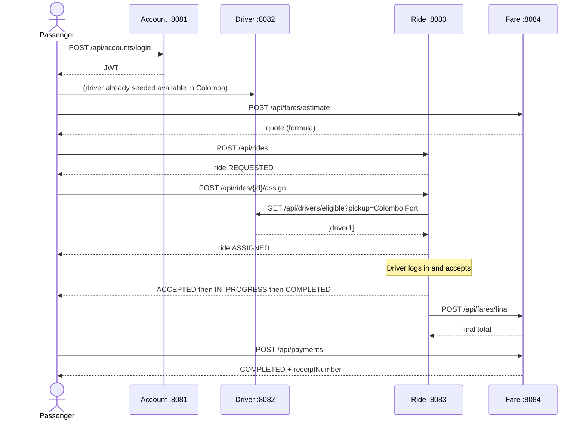

# RideLink architecture

IT3130 RideLink is four independently executable Spring Boot services. Each service owns its database. Clients are Swagger UI and Postman. There is no frontend and no API gateway in this scaffold.

## Services and data ownership



| Service | Owns (never queried by others) | Identifiers it mints | Identifiers it may store as foreign *references* |
| --- | --- | --- | --- |
| Account | `accounts` (credentials, role, status, profile) | `accountId` | — |
| Driver & Vehicle | `driver_profiles` (vehicle, availability, area, location) | `driverProfileId` | `accountId` (from JWT, not joined to Account DB) |
| Ride | `rides` (request, assignment, lifecycle) | `rideId` | `passengerAccountId`, `driverAccountId`, `driverProfileId`, `fareId`, `paymentId` |
| Fare & Payment | `fare_quotes`, `payments` | `fareId`, `paymentId` | `rideId`, `accountId` |

Storing another service’s UUID is allowed. Opening that service’s tables is not.

## JWT

Account Service signs HS256 tokens:

- `sub` = account UUID
- `username`
- `role` = `PASSENGER` | `DRIVER` | `ADMIN`
- `exp`

Other services share `ridelink-common` (`JwtAuthFilter` + `JwtService`) and the same `JWT_SECRET`.

Public paths: health, OpenAPI/Swagger, and Account `register`/`login`.

## Communication choices

**Synchronous REST** for both required interservice calls.

1. **Ride → Driver** `GET /api/drivers/eligible?pickup=`  
   Assignment cannot finish without a current availability snapshot. REST keeps the workflow in one request/response. A message queue would add eventual consistency the demo does not need.

2. **Ride → Fare** `POST /api/fares/final`  
   Completion wants a fare immediately. If Fare Service is down, Ride still transitions to `COMPLETED` and records `fareNote` (graceful degradation).

**Optional later (async):** after `COMPLETED`, publish `RideCompleted` so Fare Service can retry independently, or notify the driver of a new assignment. That would be a good LO2 contrast in the report; it is not required for the scaffold.

gRPC was considered for the eligible-driver call (typed contract, slightly lower latency) and rejected for this assignment: all official clients are HTTP (Swagger/Postman), and adding protobuf would not improve marks unless the group can explain it in the viva.

## Ride lifecycle

Valid transitions (enforced in `RideStatus`):

```
REQUESTED → ASSIGNED → ACCEPTED → IN_PROGRESS → COMPLETED
REQUESTED | ASSIGNED | ACCEPTED | IN_PROGRESS → CANCELLED
COMPLETED and CANCELLED are terminal
```

## Happy-path sequence

Passenger `passenger1`, driver `driver1`, pickup `Colombo Fort`, destination `Kandy`.



## Monolith comparison (report seed)

A modular monolith would share one deployable and one database, with simpler transactions and one JWT filter. RideLink uses four services because the brief requires independent development, clear business boundaries, and future scaling. Cost: distributed failure modes, duplicated JWT config, and no cross-table joins. Those costs are accepted and mitigated with timeouts, explicit UUIDs, and a shared error body.

## Folder structure

```
Pro/
  pom.xml
  ridelink-common/          shared JWT, error body, exceptions
  account-service/
  driver-vehicle-service/
  ride-service/
  fare-payment-service/
  docs/architecture.md
  postman/
  .github/workflows/ci.yml
```
